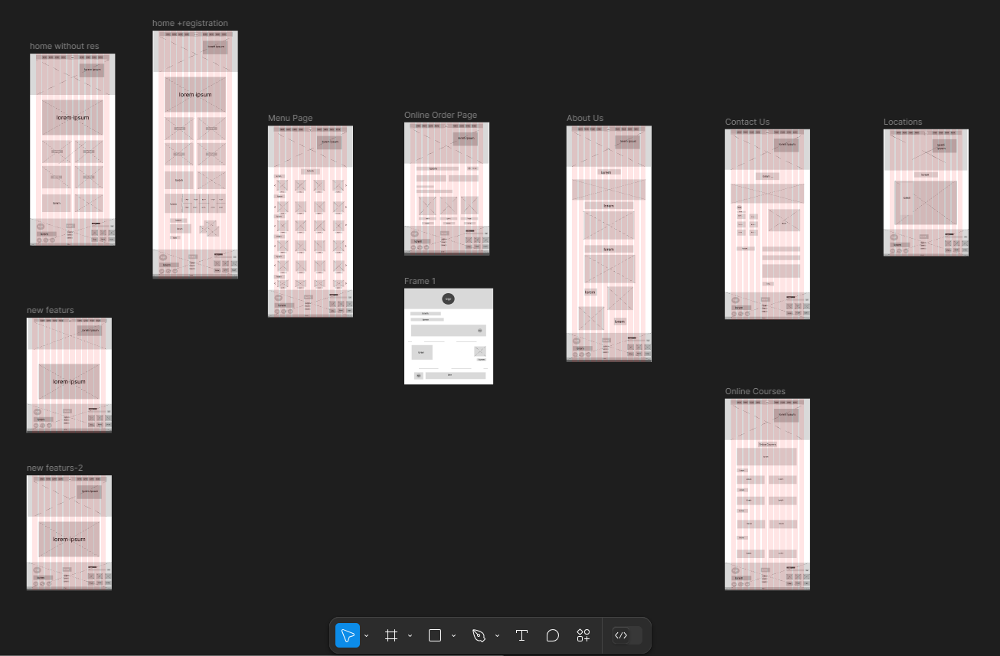
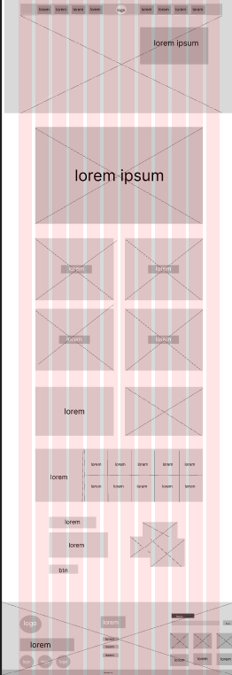
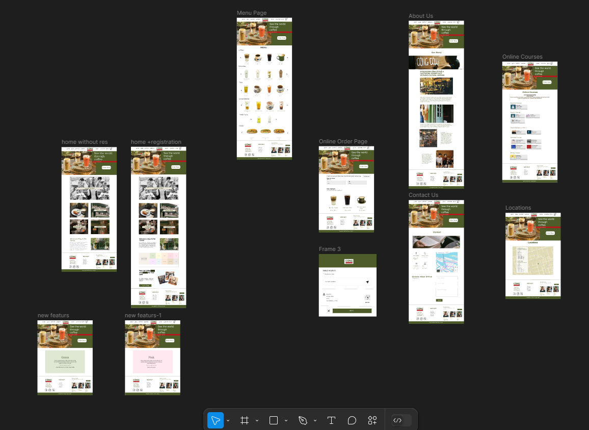
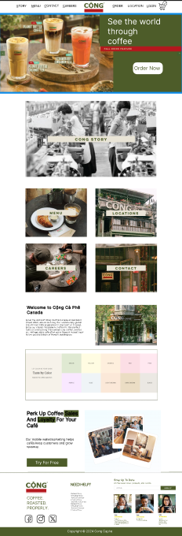

6# Wireframe-and-Mockup

## Coffee Shop Locations
Coffee shop locations are an essential part of many people's daily routines,
 offering comfortable spaces to relax, work, or meet with friends. Modern coffee shops feature stylish designs and a 
 variety of beverages and snacks to cater to all tastes. With free Wi-Fi widely available, 
they have become popular destinations for both casual and professional gatherings.

## A Traditional Vietnamese Coffee Shop in Canada
A traditional Vietnamese coffee shop established in Canada brings the charm of Vietnamese culture to a new audience.
 With its authentic décor and classic coffee recipes, such as [cà phê sữa đá] (iced coffee with condensed milk), 
 it provides a unique experience. The shop bridges the gap between tradition and modernity,
 creating a cozy space for customers to enjoy a taste of Vietnam abroad **CONG COFFEE**   .

 **WIREFRAME**
{width=400 height=400}
{width=400 height=400}

 **MOCKUP**
{width=400 height=400}
{width=400 height=400}

# This project was designed using modern technologies to ensure performance and quality[figma].

  -prototype
  [link](https://www.figma.com/proto/Qd2hXsCq4WPlyS4fcqz9UP/Wireframe-and-Mockup?node-id=56-3&node-type=frame&t=31OB5a3LR4JJlTT1-1&scaling=min-zoom&content-scaling=fixed&page-id=56%3A2)

  -Wireframe +mockup
  [link](https://www.figma.com/design/Qd2hXsCq4WPlyS4fcqz9UP/Wireframe-and-Mockup?node-id=0-1&t=lcSbuKExEB8H4fAf-1)